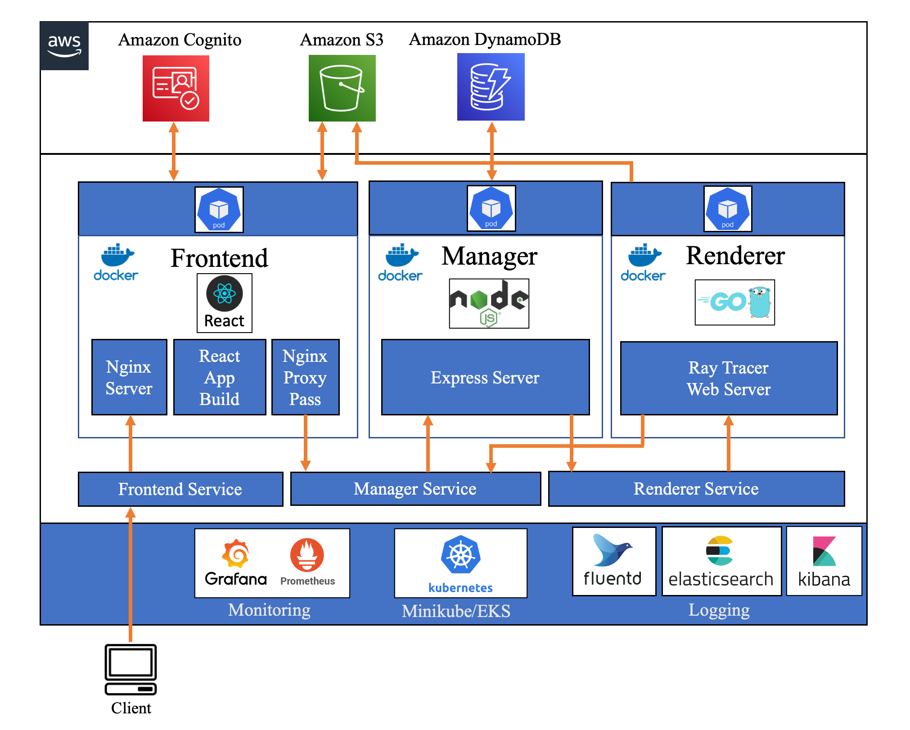
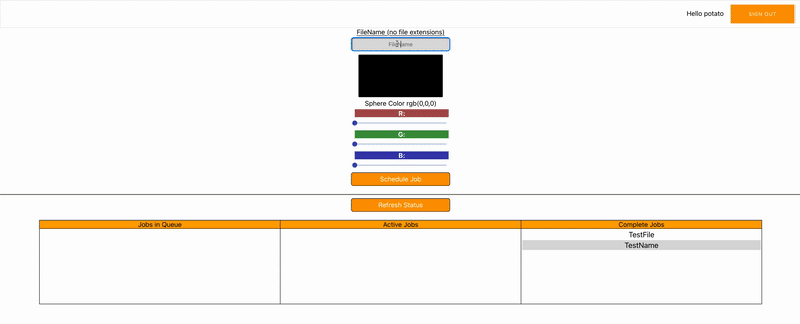
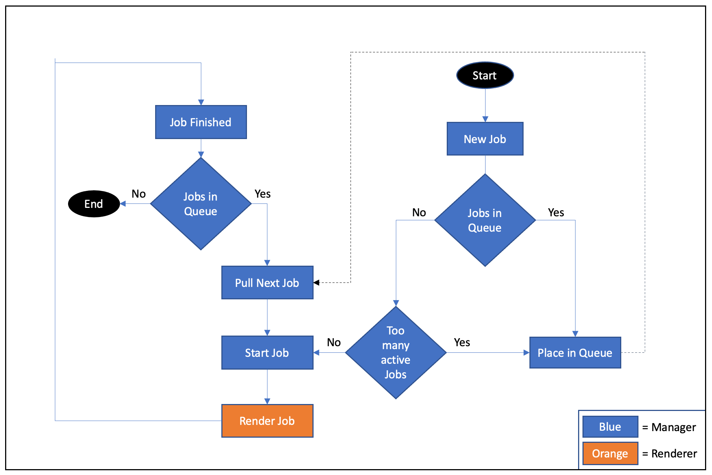

# Potato Farm Cloud Renderer
Implementation of a scalable cloud renderer. The system consists of three independently scalable primary components as outlined below. 

#### For an overview and demo of the system feel free to refer to the YouTube video **[Building a Cloud Renderer with Kubernetes and AWS](https://youtu.be/EC9_PL-RwtA)**. The video walks through the architecture and shows the system in action.

### [Frontend](./src/frontend/) 
React based interface where the user can create and schedule new rendering jobs. The system is simplified in that it renders a single scene, but the user can set the color of the primary sphere. The AWS Amplify library is used to interface with Cognito(Auth) and S3(retrieved finished images).
### [Manager/Scheduler](./src/manager/)
Nodejs express server operating as the scheduler/manager that communicates with the frontend, renderer, and DynamoDB table for job tracking. The scheduler determines whether or not to start a rendering job or place it in the queue. The system will automatically process backlogged jobs in a FIFO order.
### [Renderer](./src/renderer/)
Ray tracer based on [_Ray Tracing in One Weekend_](https://raytracing.github.io/books/RayTracingInOneWeekend.html). Implementation in Go extended from Hunter Loftis' [repo](https://github.com/hunterloftis/oneweekend). Ray tracer was wrapped with a web api and extended to communicate with Amazon S3 and work with in memory .PNG files instead of file system .PPM.
## System Architecture

### [Deployment configurations](./app-deployment/)

## Frontend Interface

## Scheduling Logic

## Example Render

## Future Work
- Extend the system to except a more complex scene definition
- Integrate a WebGL view in the UI to see a preview of the scene
- Extend system to see job progress in the UI