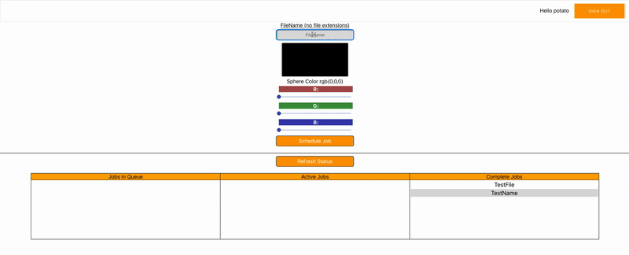

# Frontend UI

React based interface where the user can create and schedule new rendering jobs. The system is simplified in that it renders a single scene, but the user can set the color of the primary sphere. The AWS Amplify library is used to interface with Cognito(Auth) and S3(retrieved finished images).
## Build
>Note that you should replace the docker image names with your own repo/image name in the makefile. The frontend is also looking for build time args for the cognito user pool and identity pool. Get the user pool id, identity pool id, and web client id and export them as environment variables before running docker build. The env variables will need to be defined as
```
export REACT_APP_ID_POOL="XXXXX"
export REACT_APP_WEB_CLIENT_ID="XXXXX"
export REACT_APP_USER_POOL="XXXXX"
```
Build your docker image.
```
make Docker
```
Push to DockerHub
```
make Push
```

Once built and pushed refer to [deployments](../../app-deployment)

## Local Dev
Run via npm
```
npm start
```

## Demo


# Workflows
### Create Job
After filling out info, pressing "Schedule" Job will pass the info to the manager for scheduling.
### Get Status
Asks the manager to pull all the info of jobs in the system and displays them in each table.
### Delete Completed
Passed the name to the manager for deletion. Accesses object directly in S3 and deletes it.
### View Image
Based on selected name the S3 object is downloaded into the page and shown to the user.

