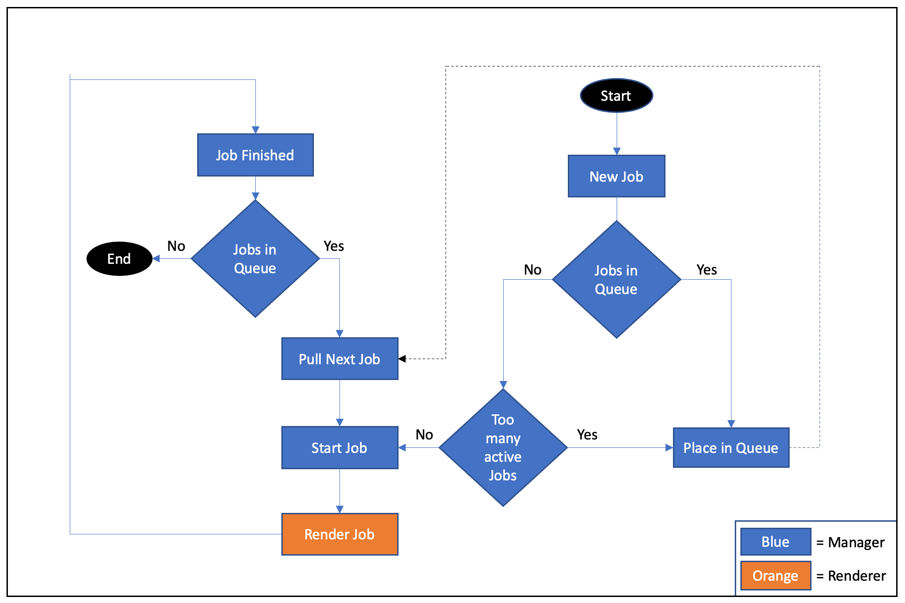

# Manager/Scheduler for cloud renderer.

## Build
>Note that you should replace the docker image names with your own repo/image name in the makefile.
Build your docker image.
```
make Docker
```
Push to DockerHub
```
make Push
```
Once built and pushed refer to [deployments](../../app-deployment)

## Scheduling Logic
